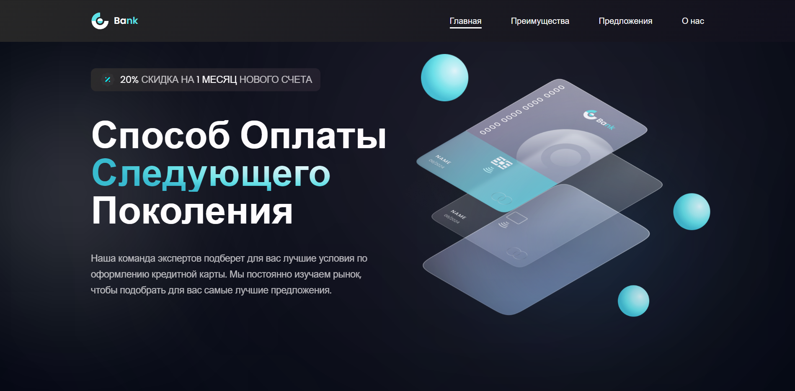

<h3 
  align="left"
>
  Привет! Я занимаюсь веб-разработкой.
</h3>

<h3 
  align="left"
>
  В разработке использую следующие технологии:
</h3>

  

<h3 
  align="left"
>
  Мои проекты:
</h3>

  <h4>Сайт банка следующего поколения.</h4>
  

    <a href="https://github.com/kostin-s/bank_landing">
      Перейти в репозиторий проекта.
    </a>
  

  

    <a href="https://kostin-s.github.io/bank_landing/" target="_blank">
      Посмотреть запущенный проект.
    </a>
  

  

  <h4>Сервис сокращения ссылок.</h4>
  

    <a href="https://github.com/kostin-s/short_link">
      Перейти в репозиторий проекта.
    </a>
  

  

    <a href="https://kostin-s.github.io/short_link/" target="_blank">
      Посмотреть запущенный проект.
    </a>
  

  

  <h4>Карточки товаров.</h4>
  

    <a href="https://github.com/kostin-s/cards-cat">
      Перейти в репозиторий проекта.
    </a>
  

  

    <a href="https://kostin-s.github.io/cards-cat/" target="_blank">
      Посмотреть запущенный проект.
    </a>
  

  

